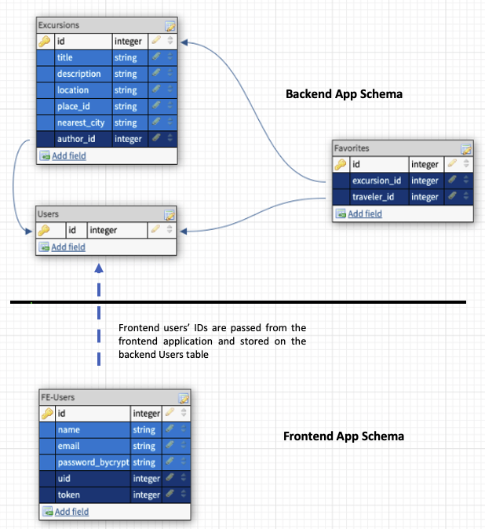

# Go Local-FE

## Table of Contents

-   [Description](#description)
-   [Database Schema](#database_schema)
-   [Technologies Used](#technologies-used)
-   [Local Setup](#local-setup)
-   [Learning Goals](#learning-goals)
-   [Authors](#authors)
-   [Statistics](#statistics)

## Description
Go Local allows travelers to experience their destinations like a local by inviting local users to suggest authentic travel experiences for visitors to enjoy. The app follows a Service-Oriented Architecture pattern and consists of:
  - a front-end Rails application, which provides a user interface;
  - a [back-end Rails application](https://github.com/Team-Go-Local/go_local_backend), which manages the app's database;
  - a [Sinatra Places microservice application](https://github.com/Team-Go-Local/go_local_microservice) to retrieve information from the Google Places API;
  - and a [Sinatra Cities micro-service application](https://github.com/Team-Go-Local/go_local_cities_api), which retrieves the nearest large city to destinations added by our users. 

This repository houses the front-end Rails application.

#### To view the deployed application, please visit [Go Local](https://go-local-fe.herokuapp.com) on Heroku

## Database Schema

## Technologies Used
- Rails v. 5.2.4
- Ruby v. 2.5.3
- PostgreSQL
- JavaScript ES5
- [Google Maps JavaScript API](https://developers.google.com/maps/documentation/javascript/overview)
- Google OAuth2
- Heroku
- Travis-CI
- Dependencies:
  - OmniAuth
  - Faraday
  - Fast JSON API
- Testing tools:
  - RSpec
  - FactoryBot
  - Faker
  - Capybara
  - SimpleCov
  - Webmock
  - VCR

## Local Setup
  To use the project in your local environment, please follow the instructions below:

  1. Apply for an API key for Google Maps JavaScript API through [Google Maps Developer Platform](https://developers.google.com/maps/documentation/places/web-service/get-api-key). Make sure to enable the Google Maps JavaScript API for your key on the Google Cloud Platform for your project and to add `http://localhost:3000` as a permitted HTTP referrer.
  2. Use your Google Cloud Platform to configure OAuth2 with callbacks pointing to `http:localhost:3000`
  3. Clone the repository: 
    `git clone git@github.com:Team-Go-Local/go_local_frontend.git`
    `cd go_local_frontend`
  4. Install gem packages 
    `bundle install`
  5. Create the database 
    `rails db:{create,migrate}`
  6. Install Figaro
    `figaro install`
  7. Enter Google credentials in `config/application.yml` using the following syntax: 
    `GOOGLE_CLIENT_ID: <your key>`
    `GOOGLE_CLIENT_SECRET: <your key>`
    `GOOGLE_MAP_KEY: <your key>`
  4. To launch a local server: 
    `rails s` 
    Once the server is running you can visit the app at `localhost:3000` 
    ex: `http://localhost:3000`
  5. To run tests and view the test coverage report: 
    `bundle exec rspec`  
    `open coverage/index.html`

## Learning Goals

    - Utilize a Service-Oriented Architecture with a front-end, a back-end, and a micro-service
    - Consume external APIs
    - Build APIs that return JSON responses
    - Use an external OAuth provider to authenticate users
    - Deploy a production-quality user interface
    - Implement an Agile workflow, including sprint planning & reviews and use of GitHub project management & code review tools

## Authors
-   Cydnee Owens | [github](https://github.com/cowens87) \| [linkedin](https://www.linkedin.com/in/cydnee-owens-5280/)
-   Gus Cunningham | [github](https://github.com/cunninghamge) \| [linkedin](https://www.linkedin.com/in/grayson-cunningham/)
-   Isabelle Villasenor | [github](https://github.com/isabellevillasenor) \| [linkedin](https://www.linkedin.com/in/isabelle-villasenor/)
-   Saundra Catalina | [github](https://github.com/saundracatalina) \| [linkedin](https://www.linkedin.com/in/saundra-catalina/)
-   Sam Yeo | [github](https://github.com/SK-Sam) \| [linkedin](https://www.linkedin.com/in/samuel-horishin-yeo/)
-   V Arruda | [github](https://github.com/nessaarruda) \| [linkedin](https://www.linkedin.com/in/vanessa-alves-de-arruda/)
-   Yesi Meza | [github](https://github.com/Yesi-MC) \| [linkedin](https://www.linkedin.com/in/yesimeza/)

## Statistics
<!-- Shields -->

